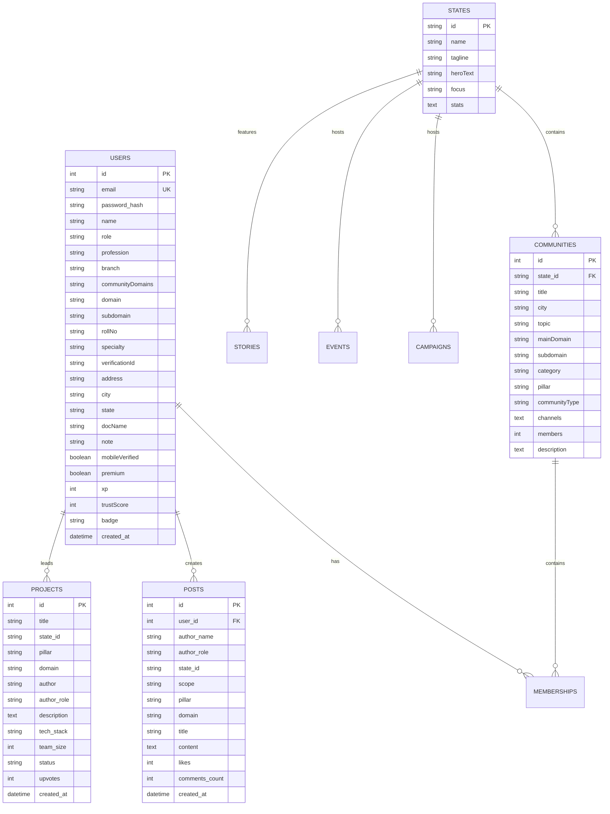

# Project Introvert (Bharat Connect) — Master Architecture & Implementation Guide

---

## 1. Executive Summary & Product Vision

### 1.1 What is Project Introvert (Bharat Connect)?
**Project Introvert (Bharat Connect)** is a decentralized, location-aware super-ecosystem platform engineered to connect India’s **28 States and 8 Union Territories** into high-trust, outcome-oriented community hubs.

Traditional social media platforms optimize for infinite scrolling, advertising impressions, and engagement algorithms. In contrast, **Project Introvert** optimizes for **actionable outcomes**:
- **Students & Colleges**: Discover peer study groups, academic research projects, AI/ML hackathons, and state curriculum reforms.
- **Law Enforcement & Police**: Rapid inter-district advisories, cyber-threat alerts (e.g., 1930 Helpline integrations), and community policing.
- **Judiciary & Legal Professionals**: Fast-track judgment indexes, legal aid clinics, case precedents, and public legal awareness.
- **Civic Leaders & Cleanliness (Swachh Bharat)**: Micro-ward waste drives, verified news broadcasts, and civic reporting.
- **Engineers & Tech Guilds**: Open-source AI tools, national tech sovereignty, cybersecurity grids, and job referrals.
- **Builders & Architects**: Smart urban infrastructure, green building standards, modular interior designs, and government tenders.
- **Citizens & Grassroots**: Local neighborhood discussions, civic ideation, verified government welfare schemes, and grassroots democracy.

---

## 2. System Architecture

### 2.1 High-Level Architecture Diagram

```
+-------------------------------------------------------------------------------+
|                             CLIENT INTERFACE (Browser)                        |
|   - Vanilla JS SPA (app.js)                                                   |
|   - Interactive SVG/Canvas Multi-State Map & State Selector                   |
|   - Glassmorphic Design System (styles.css) with Dark/Light Theme Engine      |
|   - Real-time State & Community Filter Matrix (8 Pillars x 25 Domains)        |
+---------------------------------------+---------------------------------------+
                                        | HTTP / JSON REST APIs
                                        v
+-------------------------------------------------------------------------------+
|                          PYTHON BACKEND SERVER (server.py)                    |
|   - Multi-Threaded HTTP Server (`ThreadingHTTPServer`)                        |
|   - REST API Route Dispatcher & Static File Server                            |
|   - Role-Based Access Control & SHA-256 Auth Middleware                       |
|   - Context-Aware AI Intelligence Assistant Engine (`/api/ai/ask`)            |
+---------------------------------------+---------------------------------------+
                                        | SQLite3 Driver / Queries
                                        v
+-------------------------------------------------------------------------------+
|                       DATABASE LAYER (introvert.db)                           |
|   - States & UTs Metadata (28 States + 8 UTs + All-India Hub)                 |
|   - Communities & Multi-Topic Channels                                        |
|   - Users, Roles, Verification Documents & Gamification (XP / Badges)         |
|   - Posts, Engagements, Projects, Events, Campaigns & Stories                 |
+-------------------------------------------------------------------------------+
```

### 2.2 Technology Stack

| Layer | Technology | Key Details |
|---|---|---|
| **Frontend UI** | HTML5 + Modern CSS3 | Custom Glassmorphism, CSS Custom Properties, Responsive Flex/Grid |
| **Frontend Logic** | Vanilla JavaScript (ES6+) | Single-Page Application (SPA) architecture, zero third-party framework bundle overhead |
| **Backend API** | Python 3 (`http.server.ThreadingHTTPServer`) | Zero external runtime dependencies, native multi-threading, JSON serialization |
| **Database** | SQLite 3 (`introvert.db`) | Relational database with foreign keys, indexing, JSON data payloads |
| **Authentication** | SHA-256 Hashed Passwords | Token-based session verification with verification document proof metadata |
| **AI Intelligence** | Rule-Based Semantic Matching Engine | Domain-specific situational responses with contextual fallbacks |

---

## 3. Database Design & Schema Reference

The database is structured in `introvert.db` and initialized via `database.py`.



---

## 4. The 8 Societal Pillars & 25 Domain Taxonomy

The application structures nation-wide and state-wide interactions across **8 core societal pillars**:

1. **Tech & IT Sovereignty (`tech`)**: AI/ML research, sovereign cloud, cybersecurity, semiconductors, developer guilds.
2. **Education & Students (`education`)**: College campus hubs, syllabus upgrades, competitive exams, AI study groups.
3. **Police & Civil Administration (`police`)**: 1930 Cyber helpline, inter-commissionerate advisories, disaster ops.
4. **Legal & Judiciary (`legal`)**: Fast-track court precedents, legal aid clinics, arbitration councils, bar associations.
5. **Clean India & Media (`media`)**: Swachh Bharat drives, verified journalism streams, PR & media awareness.
6. **Builders & Smart Infrastructure (`builders`)**: Green building codes, civil engineering, interior design, government tenders.
7. **Healthcare & Wellness (`health`)**: Telemedicine nodes, rural health camps, emergency blood donor network.
8. **Agriculture & Agritech (`agri`)**: Precision farming, direct farmer-to-market prices, organic supply chains.

---

## 5. REST API Specification

### 5.1 Overview of Endpoints

| Method | Endpoint | Description | Auth Required |
|---|---|---|---|
| `GET` | `/` or `/index.html` | Serves the main Single-Page Web Application | No |
| `GET` | `/api/app-data` | Fetches all states, community hubs, initial posts, projects & stats | No |
| `GET` | `/api/posts` | Queries posts filtered by `state`, `pillar`, and `scope` (`national`/`state`/`campus`) | No |
| `GET` | `/api/projects` | Queries collaboration projects filtered by `state` and `pillar` | No |
| `POST` | `/api/auth/register` | Registers a verified user with proof documents, role, and domain | No |
| `POST` | `/api/auth/login` | Authenticates a user using email and password | No |
| `POST` | `/api/posts` | Creates a new post in a specific community or state feed | Optional/Header |
| `POST` | `/api/communities/join` | Joins a user to a specific community hub | Optional/Header |
| `POST` | `/api/ai/ask` | Queries the AI Bharat Assistant for contextual guidance | No |

---

### 5.2 API Sample Payloads & Responses

#### 1. Fetch Complete Ecosystem Data
- **Endpoint**: `GET /api/app-data`
- **Response `200 OK`**:
```json
{
  "statesData": {
    "all_india": {
      "name": "🇮🇳 All-India National Hub",
      "tagline": "Unified National Community Ecosystem connecting 1.4 Billion citizens.",
      "heroText": "Empowering India's transformation into a developed nation...",
      "focus": "National Integration + Tech Sovereignty + Civic Progress",
      "stats": {
        "communities": 148,
        "events": 34,
        "actions": 85400,
        "members": 1250000
      },
      "communities": [...]
    }
  },
  "posts": [...],
  "projects": [...],
  "analytics": {
    "status": "live",
    "ecosystem": "Bharat Unified Community Platform",
    "statesCount": 37
  }
}
```

#### 2. User Verification & Registration
- **Endpoint**: `POST /api/auth/register`
- **Request Body**:
```json
{
  "name": "Arun Kumar",
  "email": "arun.kumar@bharat.dev",
  "password": "SecurePassword123!",
  "role": "student",
  "profession": "AI Research Student",
  "branch": "Computer Science & Engineering",
  "state": "tg",
  "city": "Hyderabad",
  "domain": "Technology & IT",
  "specialization": "AI/ML & State Problem Apps",
  "rollNo": "2024-CSE-8941",
  "docName": "College_ID_Card.pdf"
}
```
- **Response `201 Created`**:
```json
{
  "message": "User verified & registered successfully",
  "token": "42",
  "user": {
    "id": 42,
    "name": "Arun Kumar",
    "email": "arun.kumar@bharat.dev",
    "role": "student",
    "state": "tg",
    "city": "Hyderabad",
    "domain": "Technology & IT",
    "xp": 300,
    "trustScore": 98,
    "badge": "Verified Innovator"
  }
}
```

#### 3. AI Bharat Assistant
- **Endpoint**: `POST /api/ai/ask`
- **Request Body**:
```json
{
  "query": "How do students in Telangana collaborate on real-world projects?",
  "role": "student",
  "state": "tg"
}
```
- **Response `200 OK`**:
```json
{
  "answer": "Namaste! Bharat AI Assistant at your service. For students in TG: Your home portal automatically unlocks your State & Nearby Campus Hub. Submit your project request in the Research Collaboration Board or join the #state-issue-apps channel to collaborate with professors and peer devs!",
  "status": "success"
}
```

---

## 6. Frontend Module Breakdown

### 6.1 State Management & UI Views (`app.js`)
- **`currentView`**: Toggles dynamically between `feed`, `communities`, `projects`, `map`, `events`, and `governance`.
- **`activeState`**: Manages the currently selected state (`all_india`, `ap`, `tg`, `ka`, `mh`, `dl`, etc.).
- **`activePillar`**: Filters community feeds and project cards by societal domain.
- **`activeScope`**: Filters feeds between `all` (Pan-India), `state` (Regional), and `campus` (Local college/district).
- **`currentUser`**: Stores the authenticated and verified profile in `localStorage`.

### 6.2 Design System & Aesthetics (`styles.css`)
- **Theme Variables**: Full support for Dark Mode (`--bg-primary: #0a0f1d`) and Light Mode (`--bg-primary: #f8fafc`).
- **Glassmorphism**: Backdrop blur filters (`backdrop-filter: blur(16px)`), frosted-glass borders, and neon accent gradients.
- **Micro-Animations**: Hover elevations, channel switching transitions, live pulse badges, and badge glow rings.

---

## 7. How to Run, Test, and Deploy

### 7.1 Local Development Setup

#### 1. Clone & Navigate to Project Directory:
```bash
cd "/Users/devanboinatharun/Desktop/PROJECTS/OM NAMO VEKATESHAYA"
```

#### 2. Initialize Database (Optional / Already Seeded):
```bash
python3 database.py
```
*This populates `introvert.db` with all 28 states, 8 union territories, pre-configured community hubs, channels, seed posts, and sample collaboration projects.*

#### 3. Start the Server:
```bash
python3 server.py 8888
```
*You can pass any free port (e.g., `8888`, `5050`, `9000`). Default is `8001`.*

#### 4. Open the Web Application:
Open your browser and navigate to:
```
http://127.0.0.1:8888
```

---

### 7.2 Production Deployment

#### Option A: Running as a Systemd Service (Linux/Ubuntu)
Create `/etc/systemd/system/bharat-connect.service`:
```ini
[Unit]
Description=Project Introvert Bharat Connect HTTP Server
After=network.target

[Service]
Type=simple
User=www-data
WorkingDirectory=/var/www/project-introvert
ExecStart=/usr/bin/python3 server.py 8080
Restart=always
RestartSec=5
Environment=INTROVERT_API_KEY=your_production_secret_key

[Install]
WantedBy=multi-user.target
```

#### Option B: Nginx Reverse Proxy Configuration
```nginx
server {
    listen 80;
    server_name community.bharat.gov.in;

    location / {
        proxy_pass http://127.0.0.1:8888;
        proxy_set_header Host $host;
        proxy_set_header X-Real-IP $remote_addr;
        proxy_set_header X-Forwarded-For $proxy_add_x_forwarded_for;
    }
}
```

---

## 8. Summary of Completed Deliverables

| Deliverable | File Path | Status |
|---|---|---|
| **Product Requirements Document** | [`01_PRD_Project_Introvert.md`](file:///Users/devanboinatharun/Desktop/PROJECTS/OM%20NAMO%20VEKATESHAYA/01_PRD_Project_Introvert.md) | Completed & Documented |
| **Technical Architecture** | [`02_Technical_Architecture_Project_Introvert.md`](file:///Users/devanboinatharun/Desktop/PROJECTS/OM%20NAMO%20VEKATESHAYA/02_Technical_Architecture_Project_Introvert.md) | Completed & Documented |
| **Database Schema & Seeder** | [`database.py`](file:///Users/devanboinatharun/Desktop/PROJECTS/OM%20NAMO%20VEKATESHAYA/database.py) | Initialized & Populated |
| **SQLite Database Storage** | [`introvert.db`](file:///Users/devanboinatharun/Desktop/PROJECTS/OM%20NAMO%20VEKATESHAYA/introvert.db) | Active (86 KB, 11 Tables) |
| **Backend REST Server** | [`server.py`](file:///Users/devanboinatharun/Desktop/PROJECTS/OM%20NAMO%20VEKATESHAYA/server.py) | Running on Port 8888 |
| **Frontend Web Application** | [`index.html`](file:///Users/devanboinatharun/Desktop/PROJECTS/OM%20NAMO%20VEKATESHAYA/index.html) | Fully Interactive UI |
| **Application Logic & State** | [`app.js`](file:///Users/devanboinatharun/Desktop/PROJECTS/OM%20NAMO%20VEKATESHAYA/app.js) | Completed SPA Engine |
| **Glassmorphic Styling & Themes** | [`styles.css`](file:///Users/devanboinatharun/Desktop/PROJECTS/OM%20NAMO%20VEKATESHAYA/styles.css) | Dark/Light Responsive UI |
| **Master Documentation & Guide** | [`PROJECT_DOCUMENTATION_AND_IMPLEMENTATION_GUIDE.md`](file:///Users/devanboinatharun/Desktop/PROJECTS/OM%20NAMO%20VEKATESHAYA/PROJECT_DOCUMENTATION_AND_IMPLEMENTATION_GUIDE.md) | Created & Verified |
